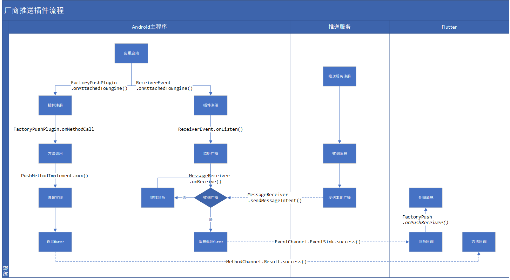

# 厂商推送插件
在Android推送方面, 常用的很多, 小米/华为/OPPO/VIVO/魅族这些厂商推送, 以及极光和信鸽这种第三方的推送服务。
但是厂商推送有自己的优势, 可以离线推送, 第三方推送的话无法离线推送, 于是就产生了第三方推送 + 厂商推送。 在第三方推送中, 需要进行厂商推送的话需要额外的收费.  

|  推送方   | 优势  | 离线推送 | 
|  :---: | :----:  |:----: |
| [小米推送](https://dev.mi.com/console/doc/detail?pId=230)  | 小米推送在MIUI上的长连接由系统维护，能够充分的保障通知栏消息在MIUI上的送达率。设备联网的情况下，有效推送的送达率能达到90%以上。| 支持小米手机离线推送(免费) |
| [华为推送](https://developer.huawei.com/consumer/cn/doc/HMSCore-Guides-V5/service-introduction-0000001050040060-V5)  | 推送服务（Push Kit）是华为为开发者提供的消息推送平台，建立了从云端到终端的消息推送通道。开发者通过集成Push Kit可以实时推送消息到用户终端应用，构筑良好的用户关系，提升用户的感知度和活跃度 | 支持华为手机离线推送(免费) |
| [OPPO推送](https://open.oppomobile.com/wiki/doc#id=10742)  | OPPO PUSH是OPPO公司向开发者提供的消息推送服务，通过服务端与OS端建立的一条稳定、可靠的长连接通道，向OPPO手机系统(ColorOS)上的APP应用客户端实时推送消息的服务。无论应用进程是否存在，均可正常收到消息。 | 支持OPPO手机离线推送(免费) |
| [VIVO推送](https://dev.vivo.com.cn/documentCenter/doc/180)  | ivo推送是vivo公司向开发者提供的消息推送服务，通过在云端与客户端之间建立一条稳定、可靠的长连接，为开发者提供向客户端应用实时推送消息的服务，支持百亿级的通知/消息推送，秒级触达移动用户。 | 支持VIVO手机离线推送(免费) |
| [魅族推送](http://open-wiki.flyme.cn/doc-wiki/index#id?129)  | 魅族推送(Push)是魅族公司向开发者提供的消息推送服务，通过在云端与客户端之间建立一条稳定，可靠的长连接，为开发者提供向客户端 App 实时推送消息的服务，通过推送消息，魅族推送服务能有效地帮助开发者拉动用户活跃度，改善产品体验。 |支持魅族手机离线推送(免费)|
| [极光推送](https://www.jiguang.cn/push)  | JPush 是经过考验的大规模 App 推送平台，每天推送消息数超过 5 亿条。 开发者集成 SDK 后，可以通过调用 API 推送消息。同时，JPush 提供可视化的 web 端控制台发送通知，统计分析推送效果。 JPush 全面支持 Android, iOS, Winphone 三大手机平台。 | 支持所有手机离线推送(收费) |
| [信鸽推送](https://xg.qq.com/docs/)  | 信鸽提供了全链路的移动推送能力，只需接入信鸽的SDK，就可以立即将推送消息送达到用户的移动设备。 | 支持所有手机离线推送(收费) |
| [mob推送](https://www.mob.com/mobService/mobpush)  | 基于MobTech大数据标签体系，针对不同场景和用户群体，实现千人千面的精准推送 | 支持所有手机离线推送(免费) |

极光和信鸽推送厂商通道收费, pass!  
mob推送支持厂商通道推送, 但是推送延迟太大, 经测试小米推送 30s - 60s 才收到通知, pass!  
那么最后的方法就是走的集成, 找了下 [flutter仓库](https://pub.dev/), 有看到 [华为推送(官方)](https://pub.dev/packages/huawei_push) 和 [小米推送(非官方)](https://pub.dev/packages/xiao_mi_push_plugin) 的插件, 如果仅需要华为或者小米推送的可以直接添加这两个, 但是没有看到全厂商的.
最后决定自己写, [小米](https://dev.mi.com/console/doc/detail?pId=230) + [华为](https://developer.huawei.com/consumer/cn/doc/HMSCore-Guides-V5/service-introduction-0000001050040060-V5) + [OPPO](https://open.oppomobile.com/wiki/doc#id=10742) + [VIVO](https://dev.vivo.com.cn/documentCenter/doc/180) + [魅族](http://open-wiki.flyme.cn/doc-wiki/index#id?129) + [极光](https://www.jiguang.cn/push)

## 插件状态
|  推送方   | 是否支持  | 完成状态 | 
|  :---: | :----:  |:----: |
|小米推送| 支持 | 已完成√ | 
|华为推送| 支持 | 已完成√ | 
|OPPO推送| 支持 | 进行中 | 
|VIVO推送| 支持 | 未开始 | 
|魅族推送| 支持 | 未开始 | 
|极光推送| 支持 | 未开始 | 

## 大致流程

参考[华为推送插件](https://github.com/HMS-Core/hms-flutter-plugin)

:smile:  :hugs: [top](#smileys--emotion)  :mask: `:mask:`
